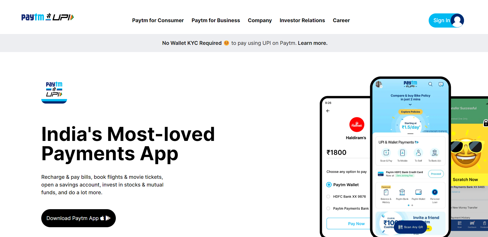
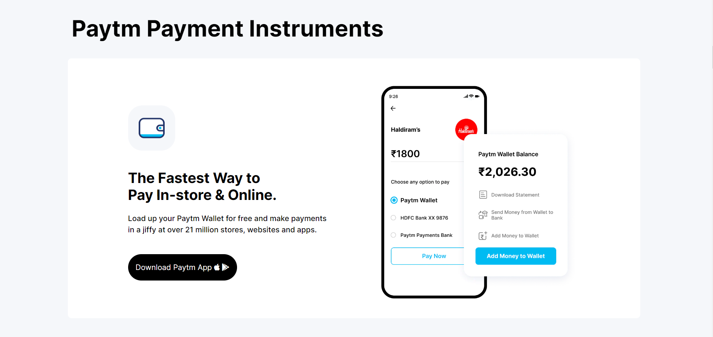
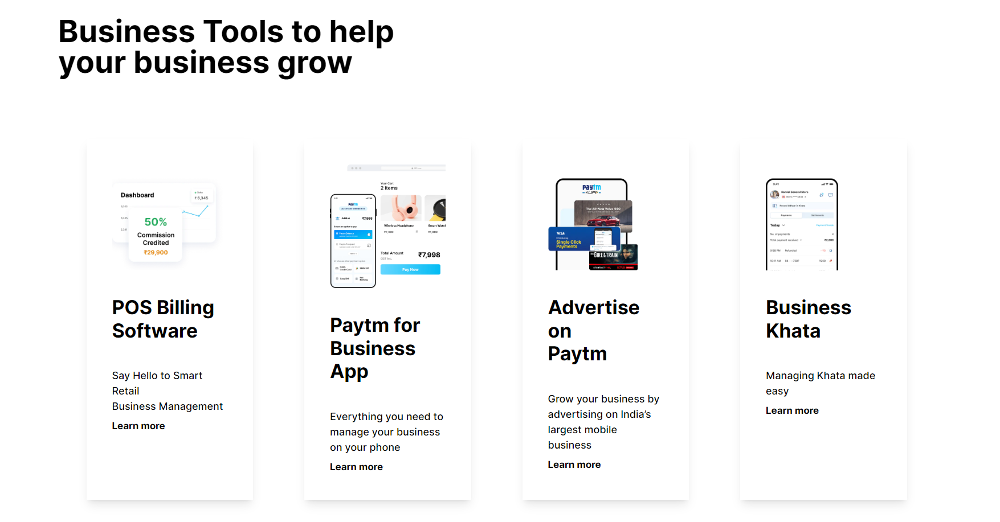
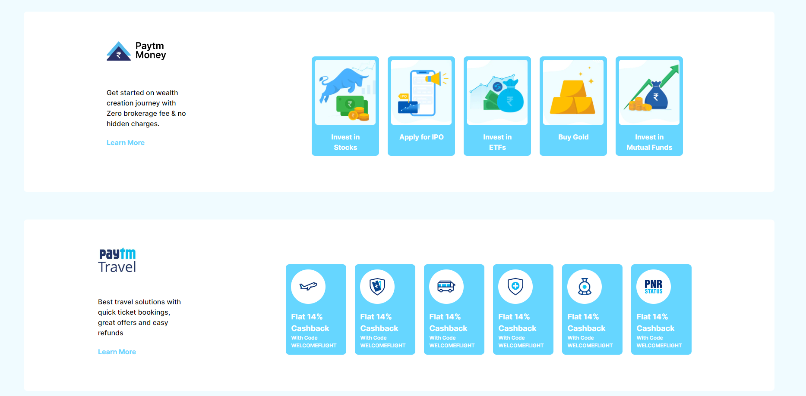

# Paytm Clone
Done By  -   

  

This project is made, using __TAILWIND CSS.__
 
  

 

 
  
 
 

  

 [Click-here for **Project Live Link**](https://tailwindcss-paytm-clone-p1.netlify.app/)
  

 **_Screenshots_** :  

 

 

### By completing this project, I learnt many things about TAILWIND CSS. Few include:

- Learnt the syntax of many traditional CSS properties like margin, padding, background flex properties etc in Tailwind CSS.
- Making a website responsive (according to different screen-sizes).
- Styling a website became handy, by using Tailwind CSS.

 ### It took me around 10 hours to complete this project ! 

 